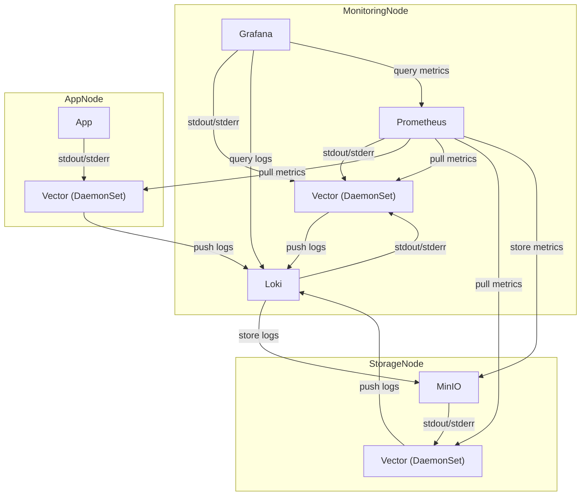

# logging-architecture-for-k8s

## Technology Stack

- Container
  - Docker
- Orchestration
  - Kubernetes (minikube)
- Demo Application
  - Golang
- Log Collection
  - Vector
- Log Storage and Query
  - Loki
- System Monitoring
  - Prometheus
- Dashboard
  - Grafana
- Object Storage
  - MinIO

## Directory Structure

```
/
├── README.md
├── app/                # Demo application source code
├── vector/             # vector settings
├── loki/               # Loki settings
├── prometheus/         # Prometheus settings
├── grafana/            # Grafana settings
├── minio/              # MinIO settings
├── k8s/                # Kubernetes manifests (deployment, DaemonSet, etc. for each component)
└── scripts/            # Verification and setup scripts
```

## Architecture Diagram


