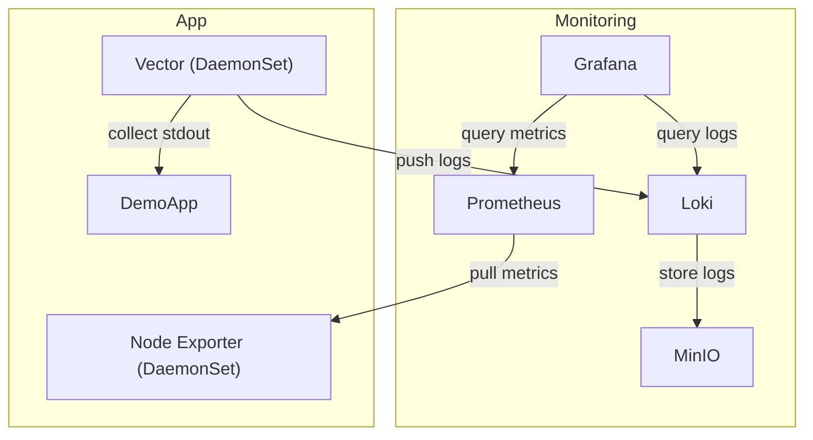

# logging-architecture-for-k8s

## Setup

```sh
nix develop
./scripts/deploy.sh

# Access Kubernetes Dashboard
./scripts/dashboard.sh

# Access Grafana
# If you want to use dashboards for the demo application and node-exporter-full,
# you need to import `grafana/*-dashboard.json` files from the Grafana dashboards page.
./scripts/grafana.sh
```

## Technology Stack

- Container
  - Docker
- Orchestration
  - Kubernetes
  - kind
- Package Manager
  - Nix
  - Helm
  - Helmfile
- Demo Application
  - Golang
- Log Collection
  - Vector
- Log Storage and Query
  - Loki
- System Monitoring
  - Prometheus
- Dashboard
  - Grafana
- Object Storage
  - MinIO

## Architecture Diagram


